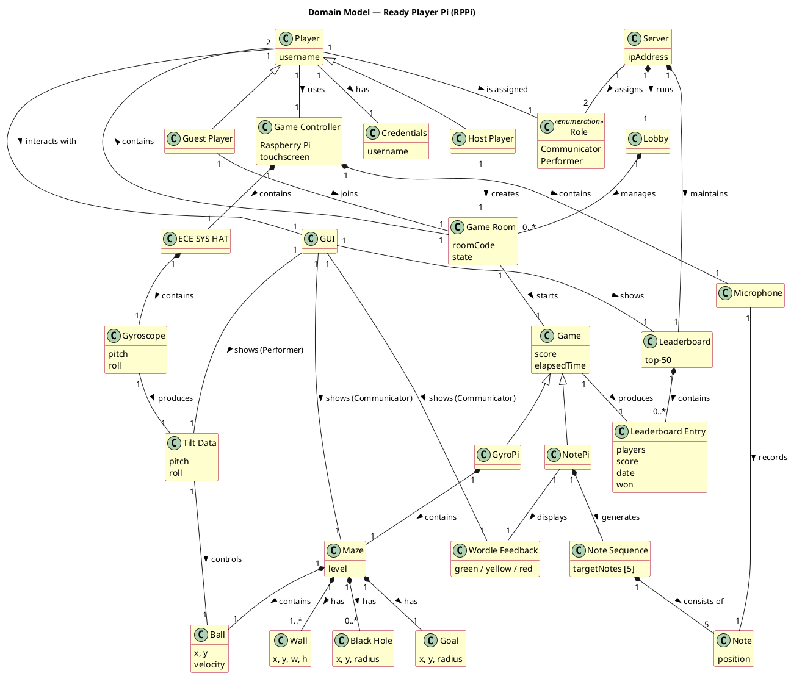

# Domain Model for RPPi (Ready Player Pi)

## Context
The domain model identifies the central concepts in the RPPi system and their relationships. It is derived through noun analysis of the requirements specification (UC-1 through UC-4, M1-M20, S1-S10) and the system sketch.   

## Domain Model (PlantUML)

The PlantUML code below generates the domain model. Render it at plantuml.com, in Draw.io, or via VS Code PlantUML plugin.

## Domain Objects and Descriptions

| Domain Object | Description | Source |
|---|---|---|
| **Player** | A person using the application. Has a username (M1). | UC-1, UC-2 |
| **Host Player** | The player who creates a Game Room and shares the Room Code. | UC-2 |
| **Guest Player** | The player who joins an existing Room via Room Code. | UC-2 |
| **Game Controller** | A Raspberry Pi with attached hardware (touchscreen, ECE HAT, microphone). | System Description |
| **ECE SYS HAT** | Hardware HAT for RPi containing the BMI160 gyroscope. | System Description |
| **Gyroscope** | Sensor measuring pitch and roll via tilting the RPi (NF10: <50ms). | UC-3, M11 |
| **Microphone** | Sensor recording audio for note classification in NotePi. | UC-4, M14 |
| **Server** | Central Raspberry Pi managing lobby, game rooms, data routing, and leaderboard. | System Description, M19 |
| **Lobby** | The server's waiting area where rooms are created and joins are handled. | UC-2 |
| **Game Room** | A session with 2 players, identified by a Room Code. | UC-2, M4-M6 |
| **Role** | Communicator (sees screen, guides verbally) or Performer (physical input, no screen). Randomly assigned. | M8, M9 |
| **Game** | An active game session with score and elapsed time. | UC-3, UC-4 |
| **GyroPi** | Concrete game: steer a ball through a maze by tilting the RPi. | UC-3 |
| **NotePi** | Concrete game: find the correct 5-note sequence with Wordle-like feedback. | UC-4 |
| **Maze** | Course in GyroPi with walls, black holes, and a goal. Has levels. | M10 |
| **Ball** | The ball controlled by the Performer's tilt data in GyroPi. | M12 |
| **Wall** | Obstacle in the maze that the ball collides with. | M10 |
| **Black Hole** | Trap in the maze — ball falls in → reset to start (M13). | UC-3 Ext.1 |
| **Goal** | Target zone — ball reaches here → game is won. | UC-3 |
| **Tilt Data** | Pitch/roll data from gyroscope sent from Performer to Server. | M11, M12 |
| **Note Sequence** | The randomly generated 5-note sequence the Performer must find. | M15 |
| **Note** | A single classified tone (C4–B4 must, A0–C8 should). | M14, M18, S10 |
| **Wordle Feedback** | Color-coded feedback per note: green (correct note+position), yellow (correct note, wrong position), red (not in sequence). | M16 |
| **Leaderboard** | Global top-50 ranking per game, sorted and saved as JSON. | S8, S9, NF15 |
| **Leaderboard Entry** | Single result: player names, score, date, won/lost. | M20 |
| **Credentials** | Locally stored username file on the player's RPi. | M1, M2 |
| **GUI** | Graphical user interface on the player's RPi (Qt6). Shows the role-specific perspective. | System Description |

## Key Relationships

- **Player** uses a **Game Controller** (RPi + hardware)
- **Host Player** creates a **Game Room**, **Guest Player** joins via Room Code
- **Server** runs a **Lobby** that manages 0..* **Game Rooms**
- A **Game Room** contains exactly 2 **Players** and starts 1 **Game**
- **Server** randomly assigns **Roles** to the 2 players
- **GyroPi** contains a **Maze** with **Ball**, **Walls**, **Black Holes**, and **Goal**
- **Gyroscope** produces **Tilt Data** which controls **Ball**
- **NotePi** generates a **Note Sequence** of 5 **Notes**; **Microphone** records Notes
- **Game** produces a **Leaderboard Entry** stored in **Leaderboard**
- **GUI** shows role-specific view: Communicator sees Maze/Wordle, Performer sees Tilt/recording

## Verification
- Render the PlantUML code at plantuml.com or in Draw.io and verify all boxes and relationships are visible
- Compare with the SON domain model style (Figure 6, page 16): box notation, named relationships, hierarchical layout
- Check that all nouns from UC-1 through UC-4 and M1-M20 are represented
